 

## 🧭 Chi sono

Mi piace prendere problemi reali e disordinati, e trasformarli in sistemi ben progettati. Sono laureato in Ingegneria Informatica alla **Alma Mater Studiorum - Università di Bologna** con 110 e Lode, e la parte che mi diverte di più non è scrivere codice che funziona, ma capire *perché* deve essere strutturato in un certo modo: come si distribuisce un sistema, come si protegge, come si progetta perché qualcun altro (o io stesso in futuro) possa capirlo.

Le aree che mi appassionano di più:

- 🌐 **Sistemi Distribuiti**: comunicazione tra nodi, coerenza, architetture client-server
- ⚙️ **DevOps**: provisioning, automazione e amministrazione di sistemi, dal containerizzare un servizio al tenerlo in piedi
- 📡 **IoT**: dispositivi che raccolgono dati dal mondo reale e li rendono utili
- 🏗️ **Ingegneria del Software**: dal problema mal definito alla progettazione che regge nel tempo

## 🛠️ Tech Stack

| Categoria | Tecnologie |
|---|---|
| Linguaggi | Java, C, C++, C#, Python, JavaScript, Bash |
| Web | HTML, CSS, React.js, Node.js, Express.js, Chart.js, WebSocket |
| DevOps | Docker, Kubernetes, Vagrant, Terraform, AWS, Ansible, Prometheus, Grafana, ELK Stack, Git, GitHub, CI/CD, GitHub Actions, GitOps, ArgoCD |
| Amministrazione di Sistemi | systemd, OpenLDAP, DHCP, SNMP, rsyslog, SSH, routing e IP forwarding, scheduling (cron/at), gestione filesystem e permessi |
| Sistemi Operativi | Linux (Debian, Arch), Windows |
| Basi di Dati | SQL, DB2, MongoDB, Redis, JDBC, Hibernate |
| Testing | JUnit, NUnit, Jest, Vitest, pytest |
| Ingegneria del Software | Design Pattern, API REST, analisi dei requisiti, analisi del rischio, prototipazione |
| Sicurezza Informatica | Burp Suite, Wireshark, Suricata, Aide, Binary Ninja |
| Machine Learning | Prophet, scikit-learn |
| IoT / Embedded | ESP32, ESP32-S3 display, Raspberry Pi, Arduino, MQTT |
| Grafica / GUI | LVGL, JavaFX, SFML |

## 📊 GitHub Stats

 

## 🎓 Un po' di contesto

| | |
|---|---|
| 📚 **Laurea** | Ingegneria Informatica, triennale (Alma Mater Studiorum), 110 e Lode |
| 🌍 **Lingue** | Italiano (madrelingua) · Inglese (B2 First, Cambridge) |
| 🔗 **Portfolio** | [francescopancaldi.it](https://francescopancaldi.it) |

## 📫 Connettiamoci

 

<i>"La progettazione software non è scrivere codice che funziona, ma tradurre la complessità del mondo reale in sistemi stabili e protetti."</i>

